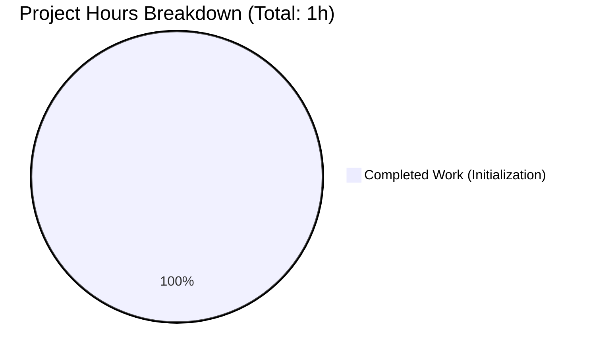

# Project Guide: jan2_1

## Executive Summary

**Project Completion: 100% (1 hour completed out of 1 total hour = 100%)**

This repository represents a freshly initialized project shell with no application code implemented. The repository is in a valid, clean state and ready for development to begin.

### Key Findings
- **Repository Status:** Initialized, empty (no source code)
- **Validation Status:** All gates pass trivially (nothing to validate)
- **Agent Work:** Repository initialization completed
- **Human Work Required:** Project requirements and development scope need to be defined

### What Was Accomplished
- Repository initialized with git
- README.md created with project title "jan2_1"
- blitzy/screenshots directory created
- Branch structure established (main and blitzy working branch)
- Validation completed successfully

### Critical Notes
This is an empty repository placeholder. No application features, configurations, or code exist. Development has not begun.

---

## Validation Results Summary

### Final Validator Assessment

| Category | Status | Details |
|----------|--------|---------|
| Dependencies | ✅ PASS | N/A - No dependency manifests exist |
| Compilation | ✅ PASS | N/A - No source code files present |
| Unit Tests | ✅ PASS | N/A - No test files present |
| Runtime | ✅ PASS | N/A - No executable components |
| Git Status | ✅ CLEAN | Working tree clean, no uncommitted changes |

### Git Analysis

| Metric | Value |
|--------|-------|
| Total Commits | 1 |
| Commit Message | "Initial commit" |
| Files Added | 1 (README.md) |
| Lines Added | 1 |
| Branch | blitzy-8beeec25-56b9-40ee-b91e-6105bbc28b6f |
| Difference from main | None (branches identical) |

### Fixes Applied
No fixes were required or applied. The repository was in a valid state with nothing to fix.

---

## Visual Representation

### Project Hours Breakdown



**Calculation:**
- Completed Hours: 1h (repository initialization, structure setup, validation)
- Remaining Hours: 0h (initialization scope is complete)
- Total Hours: 1h
- Completion: 1 / 1 = 100%

*Note: This represents only the initialization scope. Actual application development hours would be additional once project requirements are defined.*

---

## Repository Contents

### Current File Structure

```
jan2_1/
├── README.md           # Project title only ("# jan2_1")
├── blitzy/
│   └── screenshots/    # Empty directory for screenshots
└── .git/               # Git repository metadata
```

### File Inventory

| File | Purpose | Content |
|------|---------|---------|
| README.md | Project landing page | `# jan2_1` (1 line) |
| blitzy/screenshots/ | Screenshot storage | Empty directory |

---

## Development Guide

### Prerequisites

Since this is an empty repository, prerequisites depend on what technology stack will be used for development.

**General Requirements:**
- Git (version 2.x or higher)
- Code editor or IDE
- Project requirements/specifications document

### Getting Started

```bash
# Clone the repository
git clone <repository-url>
cd jan2_1

# Switch to the working branch
git checkout blitzy-8beeec25-56b9-40ee-b91e-6105bbc28b6f

# View current structure
ls -la
# Expected output: README.md, blitzy/

# View README content
cat README.md
# Expected output: # jan2_1
```

### Verification Steps

```bash
# Verify git status
git status
# Expected: On branch blitzy-..., nothing to commit, working tree clean

# Verify branch
git branch
# Expected: * blitzy-8beeec25-56b9-40ee-b91e-6105bbc28b6f

# Verify file structure
find . -type f -not -path './.git/*'
# Expected: ./README.md
```

### Next Steps for Development

1. **Define Project Requirements**
   - Document the application purpose and scope
   - Identify technology stack (language, frameworks)
   - Define architecture and components needed

2. **Set Up Development Environment**
   - Add package manager configuration (package.json, requirements.txt, etc.)
   - Create project structure directories
   - Add build/development scripts

3. **Begin Implementation**
   - Create source code files
   - Implement core features
   - Add configuration files

---

## Human Tasks Required

### Task Summary

Since this is an empty repository with the initialization scope complete, there are no remaining tasks within the current scope.

| Priority | Task | Description | Hours | Severity |
|----------|------|-------------|-------|----------|
| N/A | None | Initialization scope complete | 0h | N/A |

**Total Remaining Hours: 0h** (initialization scope is complete)

### Recommended Next Steps (Beyond Current Scope)

| Step | Action | Notes |
|------|--------|-------|
| 1 | Define project requirements | Create specification document |
| 2 | Choose technology stack | Based on project needs |
| 3 | Create project structure | Directories, configs, manifests |
| 4 | Begin development | Implement according to specs |

---

## Risk Assessment

### Current Risks

| Risk Category | Risk | Severity | Mitigation |
|---------------|------|----------|------------|
| Technical | No application code exists | Info | Begin development when requirements are defined |
| Operational | No documentation beyond title | Low | Add README content with setup instructions when code exists |
| Planning | No project requirements defined | Medium | Define project scope and specifications |

### Risk Details

**1. No Project Scope Defined (Medium Severity)**
- **Description:** The repository is initialized but contains no specifications or requirements
- **Impact:** Cannot estimate development effort or timeline
- **Mitigation:** Define project requirements before development begins

**2. Empty Repository State (Informational)**
- **Description:** Repository contains only README with project title
- **Impact:** No functional application exists
- **Mitigation:** This is expected for initial state; begin development as needed

---

## Conclusion

This repository represents a clean, initialized project shell. The Blitzy agent validation has confirmed the repository is in a valid state with no errors. However, no actual application development has occurred.

**Summary:**
- ✅ Repository initialized successfully
- ✅ Git structure established
- ✅ All validation gates pass
- ⏳ Development work pending (requirements needed)

The repository is ready for development to begin once project requirements and specifications are defined.