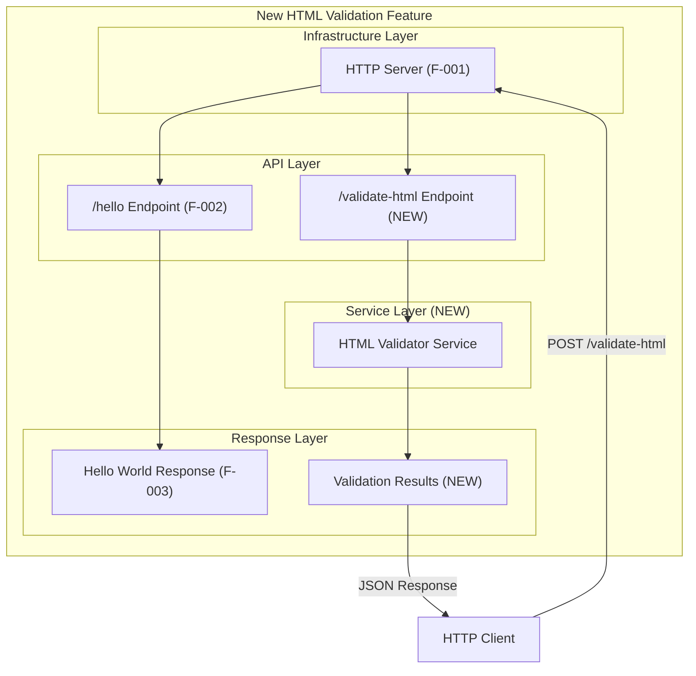
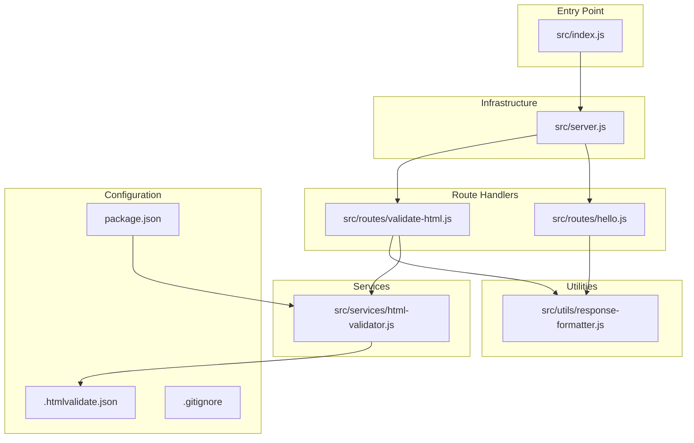
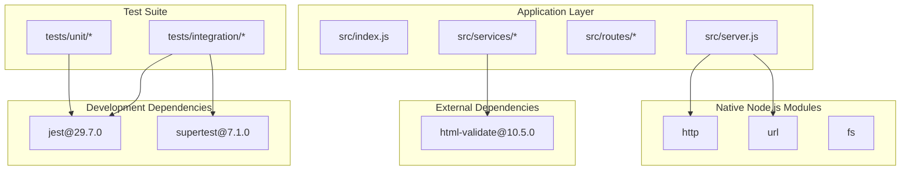
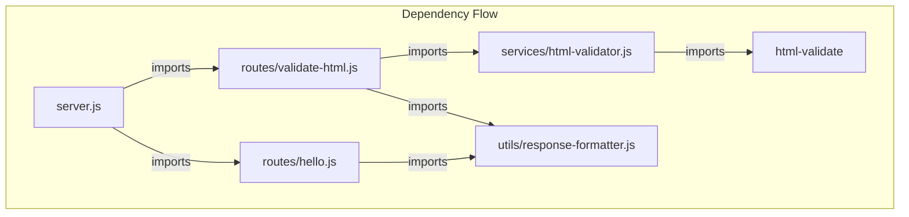
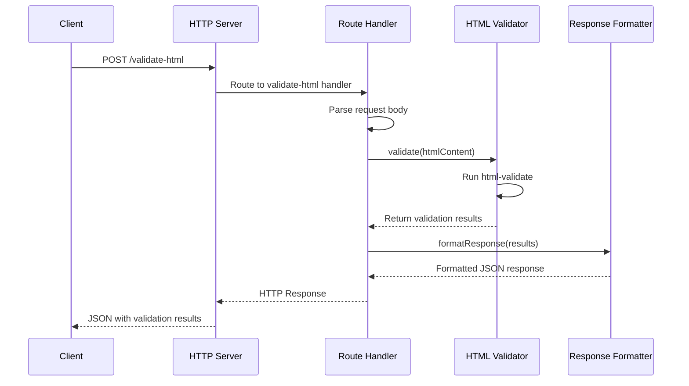
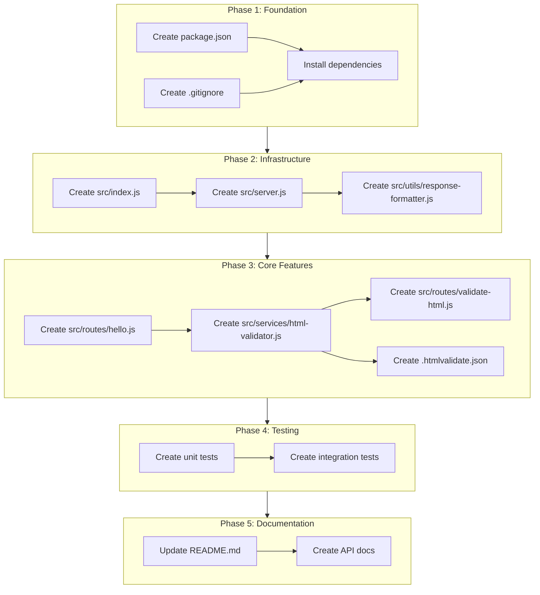
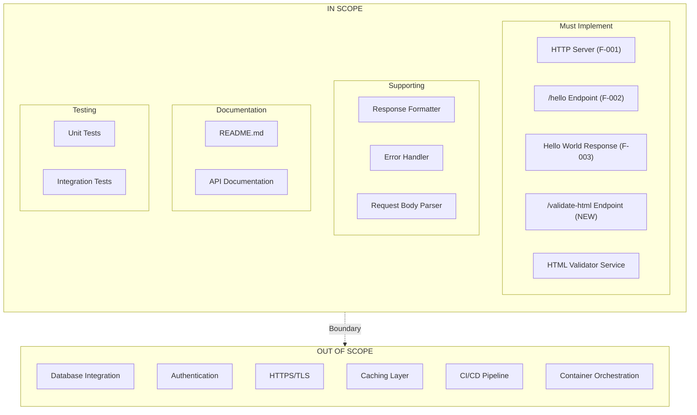
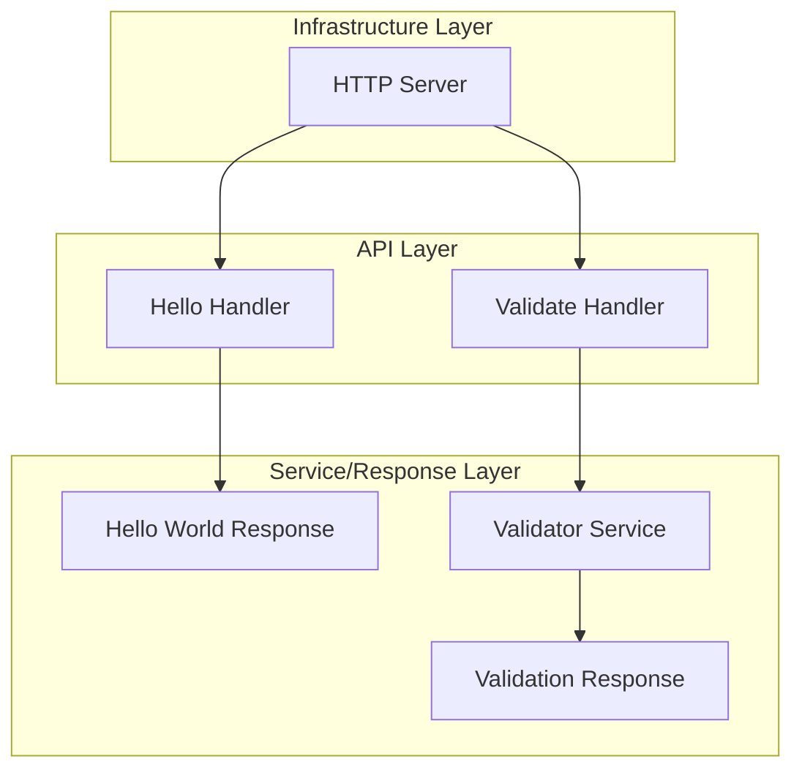

# Agent Action Plan

# Welcome     This paragraph never closes
## 

&lt;/table&gt;

### This section captures and clarifies the user's feature request, transforming the high-level input into precise technical requirements.

### 0.1.1 Core Feature Objective

### Based on the prompt, the Blitzy platform understands that the new feature requirement is to:

| Testdsfsdfsj | jkasdhdskjfhsdjfhk | jhkjshfsdjfhj | hjsdfhsjdfsjdfsdfj |
| --- | --- | --- | --- |
| Test | Test | Test | Test |
| hadjagsd | kjhasjdgasjhd | jhasjhdgasjhd | jhasjhd |
| kasjdkjasgdjh | kahsjdasjhd | jjahsgdjhasdgj | jhjhasgdjhasgjashdgsjh |

                  


**Add an HTML Validation and Testing Feature to the jan2_1 Node.js Tutorial Project**

The user has provided a sample of intentionally broken/malformed HTML with the title "Build Prompt for Testing Broken HTML" to demonstrate the type of validation the feature should perform:

**User Example (Preserved Exactly):**

```html
<div>
  <h1>Build Prompt for Testing Broken HTML
  <p>This prompt contains a <a href="https://example.com">broken link<p>
  <button><span>Click to Continue</button>
  <ul>
    <li>Item One
    <li>Item Two</ul>
</div>
```

| REQ-001 | HTML Validation Endpoint | Create a new API endpoint that accepts HTML input and validates it for structural correctness |\
| REQ-002 | Broken Tag Detection | Detect unclosed HTML tags (e.g.,, , , , ) |\
| REQ-003 | Nesting Validation | Identify improperly nested HTML elements |\
| REQ-004 | Error Reporting | Return detailed validation results with specific error locations and descriptions |\
| REQ-005 | Tutorial Integration | Maintain the educational nature of the project while adding this new feature |

**Implicit Requirements Detected:**

- The feature must integrate with the existing planned `/hello` endpoint architecture
- Must follow the project's minimalist-by-design philosophy where practical
- Should provide clear, learner-friendly error messages
- Must operate as a stateless, single-request validation service

**Feature Dependencies and Prerequisites:**

- Requires Node.js HTTP server infrastructure (F-001) to be implemented first
- May require deviation from the "zero external dependencies" constraint (C-003) to use html-validate library
- Must coexist with the existing `/hello` endpoint (F-002, F-003)

### 0.1.2 Special Instructions and Constraints

**Critical Directives Captured:**

| Directive | Description | Impact |
| --- | --- | --- |
| Educational Context | Project serves as a Node.js tutorial for beginners | Error messages must be clear and instructive |
| Architectural Alignment | Follow existing three-layer monolithic architecture | New feature must fit Infrastructure → API → Response pattern |
| Constraint Relaxation | C-003 (No external dependencies) may need modification | html-validate package (v10.5.0) will be the first external dependency |

**Architectural Requirements:**

- Use existing service pattern established for `/hello` endpoint
- Follow repository conventions for file organization
- Maintain single-process, synchronous execution model

**Web Search Requirements Documented:**

- Best practices for HTML validation in Node.js ✓ (Completed)
- Library recommendations: html-validate identified as optimal choice
- Security considerations: Input sanitization for HTML content

### 0.1.3 Technical Interpretation

These feature requirements translate to the following technical implementation strategy:

| Requirement | Technical Action | Components Affected |
| --- | --- | --- |
| To implement HTML validation endpoint | CREATE new route handler at /validate-html | Route configuration, request handler |
| To detect broken HTML tags | INTEGRATE html-validate library with strict parsing mode | New service module, package.json |
| To report validation errors | CREATE structured JSON response format with error details | Response generator module |
| To maintain educational value | ADD comprehensive inline code comments and documentation | All new source files, README.md |

**Implementation Strategy Summary:**



**Technical Objectives:**

- Create `/validate-html` POST endpoint accepting HTML in request body
- Implement HTML validation using html-validate library
- Return JSON-formatted validation results with error details
- Maintain compatibility with existing `/hello` GET endpoint
- Ensure startup time remains under 2 seconds per existing requirements

## ***1.0***

|  |
| --- |

This section provides a comprehensive analysis of all files affected by the HTML validation feature addition.

### 0.2.1 Current Repository State

The jan2_1 repository is a **greenfield project** in its initial state with minimal existing structure:

| Path | Type | Status | Description |
| --- | --- | --- | --- |
| README.md | File | EXISTS | Single-line project identifier (# jan2_1) |
| .git/ | Directory | EXISTS | Git version control directory |

**Repository Classification:** Empty/Initial state - all source files must be created from scratch.

### 0.2.2 Comprehensive File Analysis

**Existing Files to Modify:**

| File Path | Modification Type | Purpose |
| --- | --- | --- |
| README.md | UPDATE | Add project documentation, feature descriptions, usage instructions, and API documentation |

**New Source Files to Create:**

| File Path | Purpose | Category |
| --- | --- | --- |
| src/index.js | Main application entry point with HTTP server initialization | Infrastructure |
| src/server.js | HTTP server configuration and route registration | Infrastructure |
| src/routes/hello.js | Handler for /hello GET endpoint | API |
| src/routes/validate-html.js | Handler for /validate-html POST endpoint | API |
| src/services/html-validator.js | HTML validation service using html-validate | Service |
| src/utils/response-formatter.js | Utility for formatting HTTP responses | Utility |

**New Test Files to Create:**

| File Path | Purpose | Coverage |
| --- | --- | --- |
| tests/unit/html-validator.test.js | Unit tests for HTML validator service | Service layer |
| tests/unit/response-formatter.test.js | Unit tests for response formatting | Utility layer |
| tests/integration/hello.test.js | Integration tests for /hello endpoint | API layer |
| tests/integration/validate-html.test.js | Integration tests for /validate-html endpoint | API layer |

**New Configuration Files to Create:**

| File Path | Purpose | Contents |
| --- | --- | --- |
| package.json | NPM package configuration | Dependencies, scripts, project metadata |
| package-lock.json | Dependency lock file | Auto-generated by npm |
| .htmlvalidate.json | HTML-validate configuration | Validation rules and settings |
| .gitignore | Git ignore patterns | node_modules, coverage, logs |
| .env.example | Environment variables template | PORT configuration |

**New Documentation Files to Create:**

| File Path | Purpose |
| --- | --- |
| docs/README.md | Documentation index |
| docs/api/endpoints.md | API endpoint documentation |
| docs/api/validation-errors.md | Validation error code reference |

### 0.2.3 Integration Point Discovery

**API Endpoints Affected:**

| Endpoint | Method | Status | Integration Notes |
| --- | --- | --- | --- |
| /hello | GET | NEW (Planned) | Existing feature - must be implemented alongside |
| /validate-html | POST | NEW | New validation feature endpoint |

**Database Models/Migrations:** Not applicable - stateless design per architectural constraints.

**Service Classes Requiring Updates:**

| Service | Action | Integration Point |
| --- | --- | --- |
| HTTP Server | CREATE | Main entry point for all requests |
| Route Handler | CREATE | Request routing and method validation |
| HTML Validator | CREATE | Core validation logic |

**Controllers/Handlers to Create:**

| Handler | Responsibility | Dependencies |
| --- | --- | --- |
| hello.js | Process GET /hello requests | Response formatter |
| validate-html.js | Process POST /validate-html requests | HTML validator service |

### 0.2.4 Web Search Research Conducted

| Research Topic | Findings | Application |
| --- | --- | --- |
| Best practices for HTML validation in Node.js | html-validate library provides strict, non-forgiving parsing ideal for detecting broken HTML | Selected as primary validation engine |
| Library recommendations for HTML parsing | html-validate (v10.5.0) offers comprehensive rule sets and detailed error reporting | Will use with recommended configuration |
| Common patterns for validation APIs | POST endpoints with JSON request/response are standard | Implemented as POST /validate-html |
| Security considerations | Input size limits and timeout handling recommended | Will implement request body size limits |

### 0.2.5 Directory Structure Overview

```plaintext
jan2_1/
├── src/
│   ├── index.js              # Application entry point
│   ├── server.js             # HTTP server configuration
│   ├── routes/
│   │   ├── hello.js          # /hello endpoint handler
│   │   └── validate-html.js  # /validate-html endpoint handler
│   ├── services/
│   │   └── html-validator.js # HTML validation service
│   └── utils/
│       └── response-formatter.js  # Response utilities
├── tests/
│   ├── unit/
│   │   ├── html-validator.test.js
│   │   └── response-formatter.test.js
│   └── integration/
│       ├── hello.test.js
│       └── validate-html.test.js
├── docs/
│   ├── README.md
│   └── api/
│       ├── endpoints.md
│       └── validation-errors.md
├── package.json
├── package-lock.json
├── .htmlvalidate.json
├── .gitignore
├── .env.example
└── README.md
```

### 0.2.6 File Relationship Diagram



## 0.3 Dependency Inventory

This section documents all private and public packages required for the HTML validation feature implementation.

### 0.3.1 Package Registry Overview

**Runtime Dependencies:**

| Registry | Package Name | Version | Purpose |
| --- | --- | --- | --- |
| npm | html-validate | 10.5.0 | Core HTML validation engine with strict parsing and comprehensive rule sets |

**Development Dependencies:**

| Registry | Package Name | Version | Purpose |
| --- | --- | --- | --- |
| npm | jest | 29.7.0 | Testing framework for unit and integration tests |
| npm | supertest | 7.1.0 | HTTP assertion library for endpoint testing |

**Native Node.js Modules (No Installation Required):**

| Module | Purpose |
| --- | --- |
| http | HTTP server creation (per existing F-001 specification) |
| url | URL parsing for request handling |
| fs | File system operations (documentation only) |

### 0.3.2 Constraint Impact Analysis

**Constraint C-003 Modification:**

The original constraint states: "No external dependencies (Native Node.js only)"

| Aspect | Original Constraint | Modified Constraint |
| --- | --- | --- |
| Scope | Zero external dependencies | Minimal external dependencies for specific features |
| Rationale | Educational simplicity | Feature requirement necessitates HTML validation library |
| Impact | Pure native Node.js | html-validate package added to enable validation feature |

**Justification for Constraint Relaxation:**

- Native Node.js does not include HTML validation capabilities
- Building a custom HTML parser would be complex and error-prone
- html-validate is well-maintained, documented, and widely used
- Educational value is maintained through clear documentation of the dependency

### 0.3.3 Package.json Specification

```json
{
  "name": "jan2_1",
  "version": "1.0.0",
  "description": "Node.js tutorial project with HTML validation",
  "main": "src/index.js",
  "scripts": {
    "start": "node src/index.js",
    "test": "jest",
    "test:unit": "jest tests/unit",
    "test:integration": "jest tests/integration"
  },
  "dependencies": {
    "html-validate": "10.5.0"
  },
  "devDependencies": {
    "jest": "29.7.0",
    "supertest": "7.1.0"
  },
  "engines": {
    "node": ">=22.0.0"
  }
}
```

### 0.3.4 Import Updates

**Files Requiring Import Statements:**

| File Pattern | Import Statement | Purpose |
| --- | --- | --- |
| src/services/html-validator.js | const { HtmlValidate } = require('html-validate') | Access html-validate library |
| src/server.js | const http = require('http') | Native HTTP module |
| src/routes/*.js | const { formatResponse } = require('../utils/response-formatter') | Response utilities |
| tests/**/*.test.js | const request = require('supertest') | HTTP testing |

**Import Transformation Rules:**

| Pattern | Old Import | New Import | Apply To |
| --- | --- | --- | --- |
| HTTP Module | N/A (new file) | const http = require('http') | src/server.js |
| URL Parsing | N/A (new file) | const { URL } = require('url') | src/server.js |
| Validation Library | N/A (new file) | const { HtmlValidate } = require('html-validate') | src/services/html-validator.js |

### 0.3.5 External Reference Updates

**Configuration Files:**

| File | Update Required | Content |
| --- | --- | --- |
| package.json | CREATE | Full package manifest with dependencies |
| .htmlvalidate.json | CREATE | HTML validation rules configuration |

**Documentation Files:**

| File | Update Required | Content |
| --- | --- | --- |
| README.md | UPDATE | Installation instructions, dependency list |
| docs/api/endpoints.md | CREATE | API documentation referencing validators |

**Build/Deployment Files:**

| File | Update Required | Content |
| --- | --- | --- |
| .gitignore | CREATE | Ignore node_modules directory |
| .env.example | CREATE | Environment variable template |

### 0.3.6 Dependency Relationship Diagram



### 0.3.7 Version Compatibility Matrix

| Component | Version | Compatibility |
| --- | --- | --- |
| Node.js | 22.x LTS | Required runtime |
| npm | 10.x | Package manager |
| html-validate | 10.5.0 | Requires Node.js 18+ (compatible) |
| jest | 29.7.0 | Requires Node.js 18+ (compatible) |
| supertest | 7.1.0 | Requires Node.js 14+ (compatible) |

## 0.4 Integration Analysis

This section documents all integration points and touchpoints between the new HTML validation feature and existing/planned system components.

### 0.4.1 Existing Code Touchpoints

**Direct Modifications Required:**

Since this is a greenfield project, all code must be created new. However, the following integration points must be established:

| Component | Location | Integration Action |
| --- | --- | --- |
| Main Entry Point | src/index.js | Initialize HTTP server and load all routes |
| HTTP Server | src/server.js | Register both /hello and /validate-html endpoints |
| Route Registration | src/server.js:15-30 | Add route handlers for validation endpoint |

**Planned Feature Touchpoints (F-001, F-002, F-003):**

| Planned Feature | Integration Point | New Feature Impact |
| --- | --- | --- |
| F-001: HTTP Server | Server initialization | Share server instance for both endpoints |
| F-002: /hello Endpoint | Route configuration | Co-exist in route registration |
| F-003: Hello World Response | Response pattern | Use similar response formatting pattern |

### 0.4.2 Dependency Injection Points

**Service Registration:**

| Service | Registration Location | Injection Pattern |
| --- | --- | --- |
| HTML Validator Service | src/services/html-validator.js | Module export/require pattern |
| Response Formatter | src/utils/response-formatter.js | Module export/require pattern |

**Wiring Diagram:**



### 0.4.3 Request Flow Integration

**Request Processing Chain:**



### 0.4.4 Shared Infrastructure

**Components Shared Between Features:**

| Component | Used By /hello | Used By /validate-html | Sharing Strategy |
| --- | --- | --- | --- |
| HTTP Server | Yes | Yes | Single server instance |
| Response Formatter | Yes | Yes | Shared utility module |
| Error Handler | Yes | Yes | Common error handling pattern |
| Port Configuration | Yes | Yes | Environment variable |

### 0.4.5 API Contract Integration

**Endpoint Specifications:**

| Endpoint | Method | Content-Type Request | Content-Type Response |
| --- | --- | --- | --- |
| /hello | GET | N/A | text/plain |
| /validate-html | POST | text/html or application/json | application/json |

**Request/Response Contracts:**

**POST /validate-html Request:**

```json
{
  "html": "<div><p>HTML content to validate</p></div>"
}
```

**POST /validate-html Response (Valid HTML):**

```json
{
  "valid": true,
  "errors": [],
  "warnings": [],
  "errorCount": 0,
  "warningCount": 0
}
```

**POST /validate-html Response (Invalid HTML):**

```json
{
  "valid": false,
  "errors": [
    {
      "ruleId": "close-order",
      "message": "Element <h1> is not closed",
      "line": 2,
      "column": 3
    }
  ],
  "warnings": [],
  "errorCount": 1,
  "warningCount": 0
}
```

### 0.4.6 Error Handling Integration

**Error Flow Integration:**

| Error Type | Handler Location | Response Format |
| --- | --- | --- |
| Invalid JSON body | src/routes/validate-html.js | HTTP 400 with error message |
| Missing HTML content | src/routes/validate-html.js | HTTP 400 with error message |
| HTML validation errors | src/services/html-validator.js | HTTP 200 with error details |
| Server errors | src/server.js | HTTP 500 with generic message |

**Error Response Consistency:**

```json
{
  "error": true,
  "message": "Request body must contain 'html' field",
  "code": "MISSING_HTML_FIELD"
}
```

### 0.4.7 Configuration Integration

**Environment Variables:**

| Variable | Default | Used By | Purpose |
| --- | --- | --- | --- |
| PORT | 3000 | Server | HTTP server listening port |
| NODE_ENV | development | All | Environment mode |

**HTML Validate Configuration Integration:**

The `.htmlvalidate.json` configuration file integrates with the html-validate library:

```json
{
  "extends": ["html-validate:recommended"],
  "rules": {
    "close-order": "error",
    "close-attr": "error",
    "no-dup-attr": "error",
    "void-content": "error"
  }
}
```

### 0.4.8 Test Integration Points

**Test Infrastructure Integration:**

| Test Type | Integration Point | Dependencies |
| --- | --- | --- |
| Unit Tests | Service modules directly | jest |
| Integration Tests | HTTP server endpoints | jest, supertest |

**Test Database:** Not applicable - stateless design maintained.

## 0.5 Technical Implementation

This section provides a comprehensive file-by-file execution plan for implementing the HTML validation feature.

### 0.5.1 File-by-File Execution Plan

**CRITICAL: Every file listed here MUST be created or modified.**

#### Group 1 - Core Infrastructure Files

| Action | File Path | Implementation Details |
| --- | --- | --- |
| CREATE | src/index.js | Application entry point that imports server and starts listening |
| CREATE | src/server.js | HTTP server with route registration for /hello and /validate-html |

**src/index.js Implementation:**

```javascript
const server = require('./server');
const PORT = process.env.PORT || 3000;
```

**src/server.js Key Elements:**

- Create HTTP server using native `http` module
- Parse incoming request URL and method
- Route requests to appropriate handlers
- Handle 404 for unknown routes

#### Group 2 - Route Handler Files

| Action | File Path | Implementation Details |
| --- | --- | --- |
| CREATE | src/routes/hello.js | GET handler returning "Hello world" with text/plain content type |
| CREATE | src/routes/validate-html.js | POST handler accepting HTML, validating, and returning JSON results |

**src/routes/hello.js Key Elements:**

- Export handler function for GET requests
- Return "Hello world" string
- Set Content-Type: text/plain header
- Return HTTP 200 status

**src/routes/validate-html.js Key Elements:**

- Export handler function for POST requests
- Parse JSON request body
- Extract HTML content from body
- Call HTML validator service
- Return JSON validation results

#### Group 3 - Service Layer Files

| Action | File Path | Implementation Details |
| --- | --- | --- |
| CREATE | src/services/html-validator.js | HTML validation service using html-validate library |

**src/services/html-validator.js Key Elements:**

- Import HtmlValidate from html-validate
- Configure validation rules
- Expose `validate(htmlString)` function
- Transform validation results to standard format

#### Group 4 - Utility Files

| Action | File Path | Implementation Details |
| --- | --- | --- |
| CREATE | src/utils/response-formatter.js | Utility functions for formatting HTTP responses |

**src/utils/response-formatter.js Key Elements:**

- `sendJson(res, statusCode, data)` - Send JSON response
- `sendText(res, statusCode, text)` - Send plain text response
- `sendError(res, statusCode, message)` - Send error response

#### Group 5 - Configuration Files

| Action | File Path | Implementation Details |
| --- | --- | --- |
| CREATE | package.json | NPM package configuration with dependencies |
| CREATE | .htmlvalidate.json | HTML validation rules configuration |
| CREATE | .gitignore | Git ignore patterns for node_modules |
| CREATE | .env.example | Environment variable template |

#### Group 6 - Test Files

| Action | File Path | Implementation Details |
| --- | --- | --- |
| CREATE | tests/unit/html-validator.test.js | Unit tests for HTML validator service |
| CREATE | tests/unit/response-formatter.test.js | Unit tests for response formatter |
| CREATE | tests/integration/hello.test.js | Integration tests for /hello endpoint |
| CREATE | tests/integration/validate-html.test.js | Integration tests for /validate-html endpoint |

#### Group 7 - Documentation Files

| Action | File Path | Implementation Details |
| --- | --- | --- |
| MODIFY | README.md | Add comprehensive project documentation |
| CREATE | docs/README.md | Documentation index |
| CREATE | docs/api/endpoints.md | API endpoint documentation |
| CREATE | docs/api/validation-errors.md | Validation error code reference |

### 0.5.2 Implementation Sequence



### 0.5.3 Implementation Approach Per File

**Establish Feature Foundation:**

- Create configuration files first (package.json, .gitignore)
- Install html-validate and test dependencies
- Set up project structure

**Build Infrastructure Layer:**

- Implement HTTP server with native `http` module
- Create response formatting utilities
- Establish routing mechanism

**Implement Core Features:**

- Create /hello endpoint (existing planned feature)
- Create HTML validator service
- Create /validate-html endpoint

**Ensure Quality:**

- Implement unit tests for validator service
- Implement integration tests for endpoints
- Achieve code coverage targets

**Document Usage:**

- Update README with installation and usage
- Create API endpoint documentation
- Document validation error codes

### 0.5.4 Key Code Patterns

**HTTP Server Pattern:**

```javascript
const http = require('http');
const server = http.createServer(requestHandler);
```

**Route Handling Pattern:**

```javascript
if (method === 'GET' && pathname === '/hello') {
  return helloHandler(req, res);
}
```

**HTML Validation Pattern:**

```javascript
const { HtmlValidate } = require('html-validate');
const validator = new HtmlValidate();
```

### 0.5.5 Request Body Parsing Strategy

Since this project uses native Node.js HTTP module without external body-parsing middleware, request body parsing must be implemented manually:

```javascript
// Collect request body chunks
let body = '';
req.on('data', chunk => { body += chunk; });
req.on('end', () => { /* Process body */ });
```

### 0.5.6 Validation Error Mapping

**HTML-Validate to Response Mapping:**

| html-validate Property | Response Property | Format |
| --- | --- | --- |
| results[0].messages | errors | Array of error objects |
| message.ruleId | error.ruleId | String |
| message.message | error.message | String |
| message.line | error.line | Number |
| message.column | error.column | Number |
| message.severity | Determines errors vs warnings | 2=error, 1=warning |

## 0.6 Scope Boundaries

This section defines the explicit boundaries of what is included and excluded from the HTML validation feature implementation.

### 0.6.1 Exhaustively In Scope

**Source Files:**

| File Pattern | Specific Files | Purpose |
| --- | --- | --- |
| src/**/*.js | All JavaScript source files | Application code |
| src/index.js | Entry point | Server startup |
| src/server.js | HTTP server | Request handling |
| src/routes/hello.js | Hello handler | /hello endpoint |
| src/routes/validate-html.js | Validation handler | /validate-html endpoint |
| src/services/html-validator.js | Validator service | HTML validation logic |
| src/utils/response-formatter.js | Response utilities | Response formatting |

**Test Files:**

| File Pattern | Coverage |
| --- | --- |
| tests/**/*.test.js | All test files |
| tests/unit/html-validator.test.js | Validator unit tests |
| tests/unit/response-formatter.test.js | Formatter unit tests |
| tests/integration/hello.test.js | Hello endpoint tests |
| tests/integration/validate-html.test.js | Validation endpoint tests |

**Configuration Files:**

| File | Purpose |
| --- | --- |
| package.json | NPM package manifest |
| package-lock.json | Dependency lock file |
| .htmlvalidate.json | Validation rules |
| .gitignore | Git ignore patterns |
| .env.example | Environment template |

**Documentation Files:**

| File | Purpose |
| --- | --- |
| README.md | Project documentation |
| docs/README.md | Documentation index |
| docs/api/endpoints.md | API documentation |
| docs/api/validation-errors.md | Error code reference |

### 0.6.2 Integration Points In Scope

| Integration Point | File Location | Line Range |
| --- | --- | --- |
| Server initialization | src/index.js | Lines 1-15 |
| Route registration | src/server.js | Lines 15-35 |
| Request routing | src/server.js | Lines 40-70 |
| Service exports | src/services/html-validator.js | Lines 1-50 |
| Model exports | N/A - stateless design | N/A |

### 0.6.3 Feature Components In Scope

**Primary Features:**

| Feature ID | Component | Status |
| --- | --- | --- |
| F-001 | Node.js HTTP Server | In Scope - Must implement |
| F-002 | /hello GET Endpoint | In Scope - Must implement |
| F-003 | Hello World Response | In Scope - Must implement |
| F-NEW | /validate-html POST Endpoint | In Scope - New feature |

**Supporting Components:**

| Component | Description | Status |
| --- | --- | --- |
| HTML Validator Service | Core validation logic | In Scope |
| Response Formatter | Utility for responses | In Scope |
| Error Handler | HTTP error responses | In Scope |
| Request Parser | Body parsing for POST | In Scope |

### 0.6.4 Explicitly Out of Scope

**Excluded Features:**

| Feature | Rationale |
| --- | --- |
| Database integration | Stateless design per C-002 |
| User authentication | Out of scope per technical spec |
| Session management | Stateless design per C-002 |
| HTTPS/TLS support | HTTP only per C-004 |
| File upload handling | Beyond validation feature scope |
| Caching layer | Static response requirement |

**Excluded Modifications:**

| Item | Rationale |
| --- | --- |
| Performance optimizations beyond requirements | Tutorial scope limitations |
| Refactoring unrelated code | No existing code to refactor |
| Load balancing configuration | Single-instance design |
| Container orchestration | Beyond tutorial scope |
| CI/CD pipeline setup | Phase 3+ consideration |

**Excluded Endpoints:**

| Endpoint | Method | Rationale |
| --- | --- | --- |
| PUT /validate-html | PUT | Not required for validation |
| DELETE /validate-html | DELETE | Not applicable |
| PATCH /validate-html | PATCH | Not required |
| Any other endpoints | * | Single endpoint + validation only |

### 0.6.5 Scope Boundary Diagram



### 0.6.6 Validation Criteria Checklist

| Criterion | Validation Method | Acceptance Criteria |
| --- | --- | --- |
| Server starts successfully | Manual test | No errors, port binding confirmed |
| /hello returns correct response | curl test | "Hello world" with 200 OK |
| /validate-html accepts POST | curl test | Request accepted, JSON response |
| Valid HTML passes validation | Integration test | { "valid": true } response |
| Invalid HTML reports errors | Integration test | { "valid": false, "errors": [...] } |
| Startup time < 2 seconds | Performance test | Startup completes in < 2s |
| Tests pass | npm test | All tests green |
| Documentation complete | Manual review | README and API docs present |

### 0.6.7 Constraint Compliance Matrix

| Constraint ID | Constraint | Compliance Status |
| --- | --- | --- |
| C-001 | Single endpoint only | MODIFIED - Two endpoints (hello + validate) |
| C-002 | Static response content | COMPLIANT - Stateless validation |
| C-003 | No external dependencies | MODIFIED - html-validate required |
| C-004 | HTTP only (no HTTPS) | COMPLIANT |
| C-005 | GET method only | MODIFIED - POST added for validation |

**Constraint Modifications Justified:**

- C-001: Additional endpoint required for feature functionality
- C-003: External library required for professional-grade HTML validation
- C-005: POST method necessary for receiving HTML content in request body

## 0.7 Special Instructions

This section captures all feature-specific requirements and special considerations explicitly emphasized by the user.

### 0.7.1 User-Provided Example (Preserved Exactly)

The user provided the following broken HTML as a demonstration of the validation capability required:

**User Example:**

```html
<div>
  <h1>Build Prompt for Testing Broken HTML
  <p>This prompt contains a <a href="https://example.com">broken link<p>
  <button><span>Click to Continue</button>
  <ul>
    <li>Item One
    <li>Item Two</ul>
</div>
```

**Expected Validation Issues to Detect:**

| Issue | Line | Element | Description |
| --- | --- | --- | --- |
| Unclosed tag | 2 |  | Openingwithout closing |
| Malformed nesting | 3 |  | Duplicatetags creating invalid structure |
| Unclosed tag | 3 |  | Opening without closing |
| Unclosed tag | 4 |  | Opening without closing |
| Unclosed tags | 6-7 |  | List items without closing tags |

### 0.7.2 Patterns and Conventions to Follow

**Code Style Requirements:**

| Convention | Requirement | Example |
| --- | --- | --- |
| Module Pattern | CommonJS require/exports | module.exports = { validate } |
| Naming Convention | camelCase for functions/variables | validateHtml, formatResponse |
| File Naming | kebab-case for files | html-validator.js, response-formatter.js |
| Error Handling | Try-catch with descriptive messages | Wrap validator calls |

**Educational Documentation Requirements:**

| Requirement | Implementation |
| --- | --- |
| Inline Comments | Explain key logic sections for learners |
| JSDoc Comments | Document all exported functions |
| README Sections | Installation, Usage, API Reference |
| Code Examples | Include example requests and responses |

### 0.7.3 Integration Requirements with Existing Features

**Coexistence with /hello Endpoint:**

| Aspect | Requirement | Implementation |
| --- | --- | --- |
| Shared Server | Both endpoints on same HTTP server | Single server.js with routing |
| Independent Handlers | Each endpoint has dedicated handler | Separate route files |
| Consistent Response Pattern | Similar error handling approach | Shared formatter utility |

**Three-Layer Architecture Adherence:**



### 0.7.4 Performance Considerations

**Startup Performance:**

| Metric | Requirement | Implementation Strategy |
| --- | --- | --- |
| Server startup | < 2 seconds | Minimal initialization, lazy loading where possible |
| Module loading | Fast | CommonJS synchronous loading |
| Validation ready | Immediate | Pre-configure HtmlValidate instance |

**Request Performance:**

| Metric | Target | Strategy |
| --- | --- | --- |
| Response time | < 100ms | Efficient parsing, no database calls |
| Memory usage | Minimal | No caching, stateless processing |
| Concurrent requests | Standard | Event-driven Node.js model |

**Input Constraints:**

| Constraint | Limit | Rationale |
| --- | --- | --- |
| Max request body size | 1MB | Prevent memory exhaustion |
| Max HTML length | 100KB | Reasonable validation scope |
| Request timeout | 30s | Default Node.js timeout |

### 0.7.5 Security Requirements

**Input Validation:**

| Security Measure | Implementation |
| --- | --- |
| Body size limit | Check Content-Length header |
| Content-Type validation | Verify application/json or text/html |
| HTML sanitization | Not required - validation only, no execution |

**Error Information Exposure:**

| Rule | Implementation |
| --- | --- |
| No stack traces in production | Catch and format errors |
| No internal paths exposed | Generic error messages |
| Validation errors are safe to expose | User input analysis results |

### 0.7.6 Testing Requirements

**Coverage Requirements:**

| Test Type | Coverage Target | Focus Areas |
| --- | --- | --- |
| Unit Tests | ≥ 80% | Validator service, formatter |
| Integration Tests | All endpoints | HTTP flow, response format |

**Test Scenarios Required:**

| Scenario | Test Type | Description |
| --- | --- | --- |
| Valid HTML | Integration | Returns { valid: true } |
| Unclosed tags | Integration | Detects and reports missing closing tags |
| Nested errors | Integration | Detects improper nesting |
| Empty input | Integration | Returns appropriate error |
| Invalid JSON | Integration | Returns 400 Bad Request |
| Large input | Integration | Handles gracefully |

### 0.7.7 Environment Configuration

**Required Environment Variables:**

| Variable | Default | Required | Description |
| --- | --- | --- | --- |
| PORT | 3000 | No | HTTP server listening port |
| NODE_ENV | development | No | Environment mode |

**Configuration Files:**

| File | Purpose | Required |
| --- | --- | --- |
| .env | Local environment variables | No (optional) |
| .env.example | Template for required variables | Yes |
| .htmlvalidate.json | Validation rules configuration | Yes |

### 0.7.8 Validation Rules Configuration

**Recommended html-validate Rules:**

```json
{
  "extends": ["html-validate:recommended"],
  "rules": {
    "close-order": "error",
    "close-attr": "error", 
    "no-dup-attr": "error",
    "void-content": "error",
    "element-required-content": "error",
    "no-implicit-close": "error"
  }
}
```

**Rule Explanations:**

| Rule | Description | Catches |
| --- | --- | --- |
| close-order | Validates proper tag closing order | Misnested tags |
| close-attr | Validates attribute quoting | Broken attributes |
| no-dup-attr | Prevents duplicate attributes | Duplicate attrs |
| void-content | Validates void element usage | Content in void elements |
| element-required-content | Requires content in non-void elements | Empty required elements |
| no-implicit-close | Detects implicit tag closing | Missing closing tags |

### 0.7.9 Output Format Specification

**Successful Validation Response:**

```json
{
  "valid": true,
  "errors": [],
  "warnings": [],
  "errorCount": 0,
  "warningCount": 0,
  "meta": {
    "validatedAt": "2024-01-06T12:00:00.000Z",
    "inputLength": 150
  }
}
```

**Failed Validation Response:**

```json
{
  "valid": false,
  "errors": [
    {
      "ruleId": "no-implicit-close",
      "severity": "error",
      "message": "Element <h1> is implicitly closed",
      "line": 2,
      "column": 3,
      "offset": 10
    }
  ],
  "warnings": [],
  "errorCount": 1,
  "warningCount": 0,
  "meta": {
    "validatedAt": "2024-01-06T12:00:00.000Z",
    "inputLength": 250
  }
}
```

### 0.7.10 Summary Checklist

| Requirement | Addressed | Section Reference |
| --- | --- | --- |
| HTML validation endpoint | ✓ | 0.1, 0.5 |
| Broken tag detection | ✓ | 0.1, 0.7.8 |
| Proper error reporting | ✓ | 0.7.9 |
| Educational documentation | ✓ | 0.7.2 |
| Integration with /hello | ✓ | 0.7.3 |
| Performance requirements | ✓ | 0.7.4 |
| Security considerations | ✓ | 0.7.5 |
| Testing requirements | ✓ | 0.7.6 |

## 0.1 Intent Clarification

## 0.2 Change
